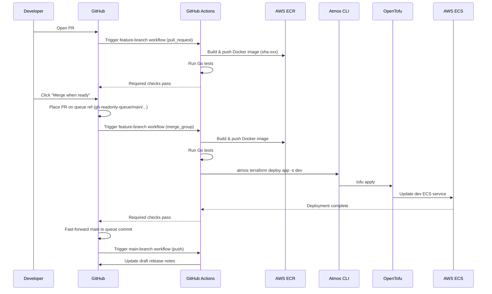
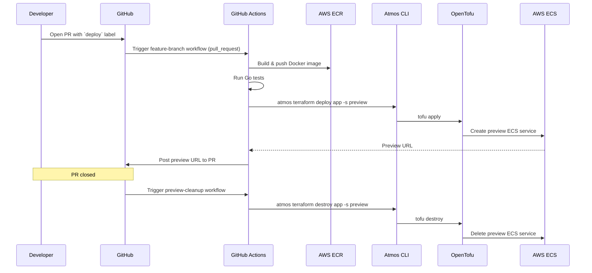
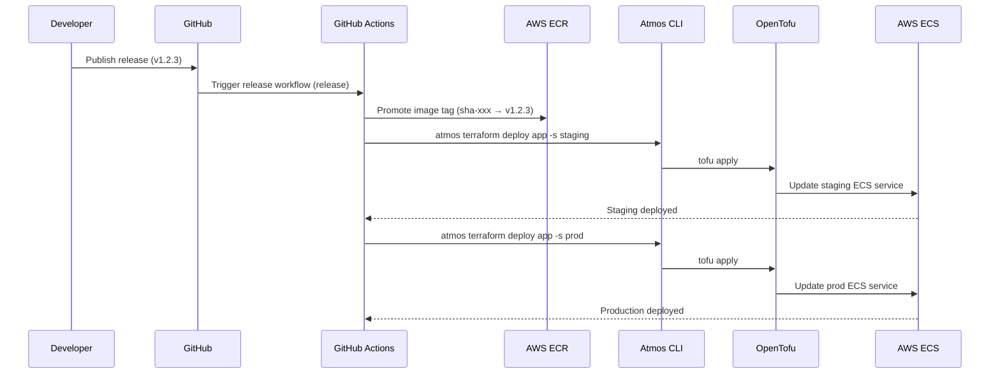
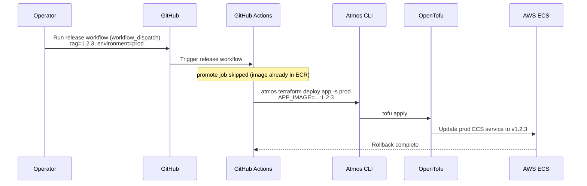
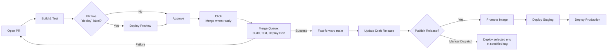

# Workflows

GitHub Actions pipelines for building, validating, and deploying the application.

| Workflow | Trigger | Action |
|----------|---------|--------|
| `feature-branch.yml` | Pull request, merge queue | Build image, run tests, deploy preview (PR with `deploy` label), deploy dev (merge queue gate) |
| `validate.yml` | Pull request, merge queue | Lint CODEOWNERS |
| `main-branch.yaml` | Push to `main` | Update draft release notes |
| `release.yaml` | Published release, manual dispatch | Promote image, deploy to staging and/or prod |
| `preview-cleanup.yml` | PR closed | Destroy preview environment |
| `labeler.yaml` | Pull request | Auto-label based on changed files |

## Conventions

### Workflows are named by trigger context

Workflow files are named for *where they fire from* (a feature branch, the main branch, a release event), not for what they do (CI/CD). Functions blur as workflows evolve — the dev deploy is technically "CD" but lives in the file that gates feature-branch merges. The trigger context, however, is fixed and unambiguous: each workflow has exactly one trigger origin. That makes trigger-based names durable.

### Dev deploy runs in the merge queue, not on push to `main`

The merge queue runs the full `build` + `test` + `deploy-dev` chain on a temporary commit (the PR rebased on top of `main`). If `atmos terraform deploy` fails, the PR is rejected from the queue and never lands on `main`. This catches a broken Terraform apply *before* it breaks dev — a stronger guarantee than deploying after merge and noticing the failure.

The `push: main` event then fires on a commit that has already been built, tested, and deployed. `main-branch.yaml` therefore only updates the draft release; it does not redo the work the queue already did.

### Staging and prod deploys do NOT run in the merge queue

GitHub environments support required reviewers (manual approval gates). If the prod environment requires approval and a queued PR is paused waiting for a human, every PR queued behind it is also blocked — head-of-line blocking. For high-PR-volume teams this collapses queue throughput.

To preserve queue throughput while keeping a human gate on production, staging/prod deploys run from `release.yaml` instead of from the queue. Releases are explicitly triggered (or manually dispatched), so any approval delay only blocks that release, not other PRs.

### `release.yaml` supports `workflow_dispatch` for rollback and out-of-band deploys

Triggering on `release: published` is great for "deploy the new version," but useless for "redeploy v1.2.3 to prod because v1.2.4 broke." `release.yaml` accepts a `tag` input (any image tag in ECR) and an `environment` input (`staging`, `prod`, or `both`), so you can roll back, hotfix, or selectively redeploy without cutting a new release. The `promote` job is skipped on dispatch (the image already exists at that tag).

### Trade-off: queue bypass

If a maintainer force-merges a PR (bypassing the queue), `main-branch.yaml` will only draft a release — it will not auto-deploy to dev. This is a deliberate trade-off: the queue is the single source of truth for dev deploys, and bypassing the queue means accepting that you are skipping the deploy gate too. Use `release.yaml` workflow_dispatch to redeploy dev (or any environment) if needed.

## Pull Request → Merge Queue → Dev

## Pull Request → Preview Environment (label-gated)

## Release → Staging → Prod

## Manual Dispatch (rollback / hotfix)

## Environment Promotion Flow

