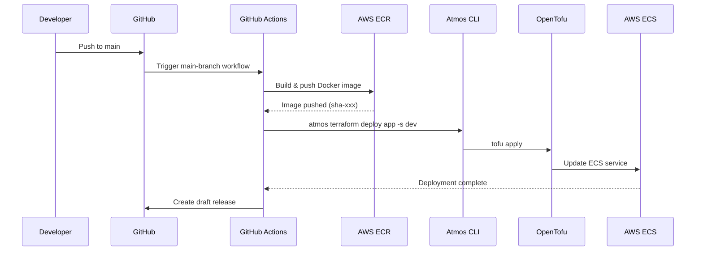
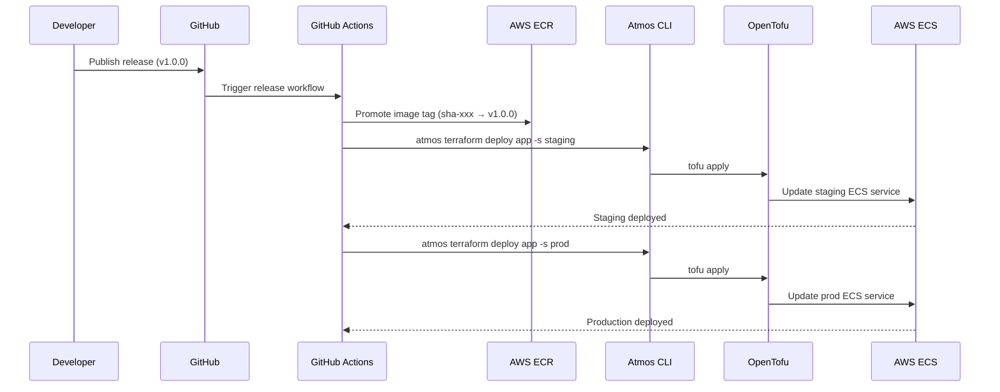
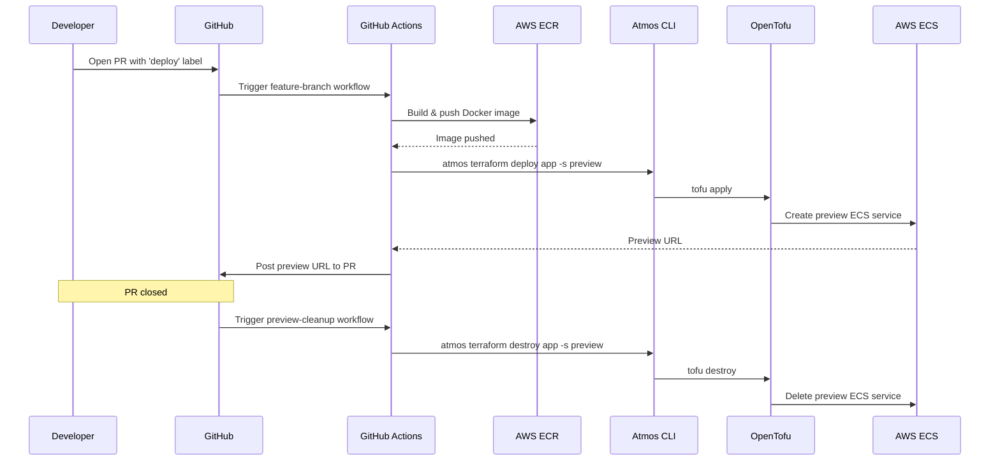
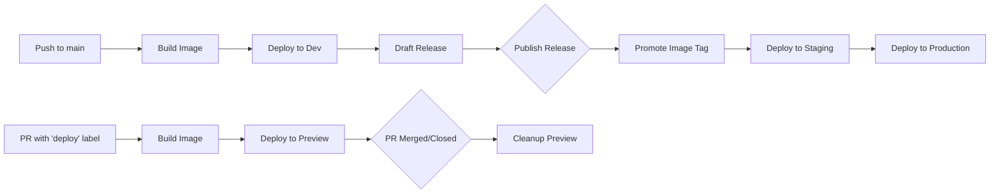

# example-app-on-ecs <a href="https://cloudposse.com/"></a>


[](https://github.com/cloudposse-examples/app-on-ecs-v2/releases/latest)
[](https://github.com/cloudposse-examples/app-on-ecs-v2/commits/main/)
[](https://slack.cloudposse.com)


Example application deployed to AWS ECS using [Atmos](https://atmos.tools) and [OpenTofu](https://opentofu.org).

This repository demonstrates an elegant, self-contained approach to deploying containerized applications on ECS Fargate with automated CI/CD pipelines.


## Introduction

### Application

A simple Go web server that serves static HTML pages.

| Endpoint | Description |
|----------|-------------|
| `/` | Index page with configurable color and request counter |
| `/dashboard` | Dashboard view |
| `/healthz` | Health check endpoint (returns `OK`) |
| `/shutdown` | Graceful shutdown trigger |

#### Environment Variables

| Variable | Default | Description |
|----------|---------|-------------|
| `COLOR` | `green` | Background color for the index page |
| `LISTEN` | `:8080` | Address and port to listen on |

### Infrastructure

This project uses:

- **[Atmos](https://atmos.tools)** - Configuration orchestration and stack management
- **[OpenTofu](https://opentofu.org)** - Infrastructure as Code (Terraform-compatible)
- **AWS ECS Fargate** - Serverless container orchestration
- **AWS ECR** - Container image registry
- **AWS EFS** - Persistent file storage (optional)


## Usage

### CI/CD Workflows

| Workflow | Trigger | Action |
|----------|---------|--------|
| `main-branch.yaml` | Push to `main` | Build image → Deploy to dev → Create draft release |
| `release.yaml` | Published release | Promote image → Deploy to staging and prod |
| `feature-branch.yml` | PR with `deploy` label | Build image → Deploy to preview environment |
| `preview-cleanup.yml` | PR closed | Destroy preview environment |
| `validate.yml` | Pull request | Run validation checks |

#### Main Branch Workflow



#### Release Workflow



#### Feature Branch Workflow (Preview Environments)



#### Environment Promotion Flow



### Deployment

#### Prerequisites

- [Atmos](https://atmos.tools/install) installed
- [OpenTofu](https://opentofu.org/docs/intro/install/) installed
- AWS credentials configured
- ECS cluster and supporting infrastructure deployed

#### Local Deployment

```bash
# Deploy to dev environment
atmos terraform deploy app -s dev

# Deploy to staging
atmos terraform deploy app -s staging

# Deploy to production
atmos terraform deploy app -s prod
```

#### CI/CD Deployment

1. Push to `main` branch → automatically deploys to dev
2. Create a GitHub release → automatically deploys to staging and prod
3. Open a PR with `deploy` label → deploys to a preview environment

### Configuration

Stack configurations are in `terraform/stacks/`. Each environment imports shared defaults and specifies environment-specific settings:

```yaml
# terraform/stacks/dev.yaml
import:
  - _default.yaml
  - defaults/app.yaml
  - deps/*

vars:
  stage: dev
```

Container configuration is defined in `terraform/stacks/defaults/app.yaml` and can be customized per environment.

### Repository Structure

```
.
├── main.go                    # Go application
├── Dockerfile                 # Multi-stage container build
├── atmos.yaml                 # Atmos configuration
├── README.yaml                # README source (this file)
├── public/                    # Static HTML assets
├── rootfs/                    # Container filesystem overlay
├── terraform/
│   ├── components/            # Terraform/OpenTofu modules
│   │   └── ecs-task/          # ECS task definition component
│   └── stacks/                # Environment configurations
│       ├── dev.yaml
│       ├── staging.yaml
│       ├── prod.yaml
│       └── preview.yaml
└── .github/
    ├── workflows/             # CI/CD pipelines
    └── README.md.gotmpl       # README template
```

### Building Documentation

To regenerate the README from this file, run:

```bash
atmos docs generate readme
```


## Related Projects

Check out these related projects.

- [Atmos](https://atmos.tools) - Universal Tool for DevOps and Cloud Automation
- [terraform-aws-components](https://github.com/cloudposse/terraform-aws-components) - Opinionated, self-contained Terraform root modules for Cloud Posse reference architecture


## Slack Community

Join our [Open Source Community](https://slack.cloudposse.com) on Slack. It's **FREE** for everyone! Our "SweetOps" community is where you get to talk with others who share a similar vision for how to rollout and manage infrastructure. This is the best place to talk shop, ask questions, solicit feedback, and work together as a community to build totally *sweet* infrastructure.

## Newsletter

Sign up for [our newsletter](https://cpco.io/newsletter) and join 3,000+ DevOps engineers, CTOs, and founders who get insider access to the latest DevOps trends, so you can always stay in the know. Dropped straight into your Inbox every week — and usually a 5-minute read.

## Office Hours <a href="https://cloudposse.com/office-hours"></a>

[Join us every Wednesday via Zoom](https://cloudposse.com/office-hours) for your weekly dose of insider DevOps trends, AWS news and Terraform insights, all sourced from our SweetOps community, plus a _live Q&A_ that you can't find anywhere else. It's **FREE** for everyone!

## License

<a href="https://opensource.org/licenses/Apache-2.0"></a>

Licensed under the Apache License, Version 2.0. See [LICENSE](LICENSE) for full details.

## Trademarks

All other trademarks referenced herein are the property of their respective owners.

---
Copyright © 2017-2025 [Cloud Posse, LLC](https://cloudposse.com)
